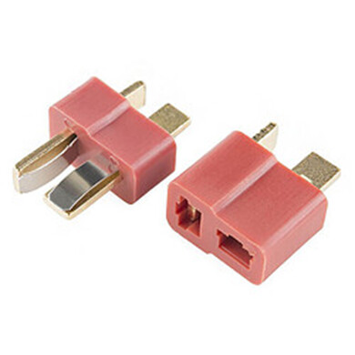
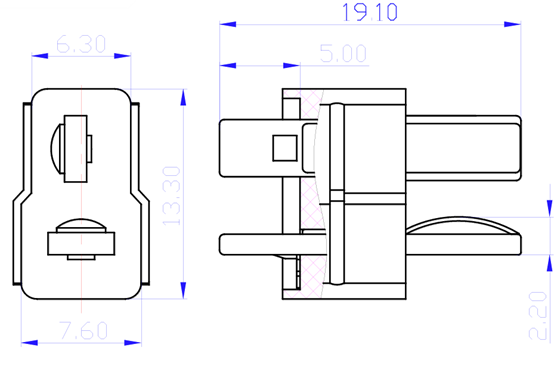
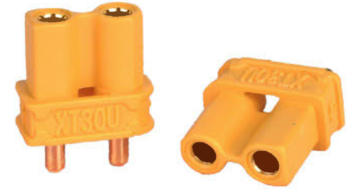
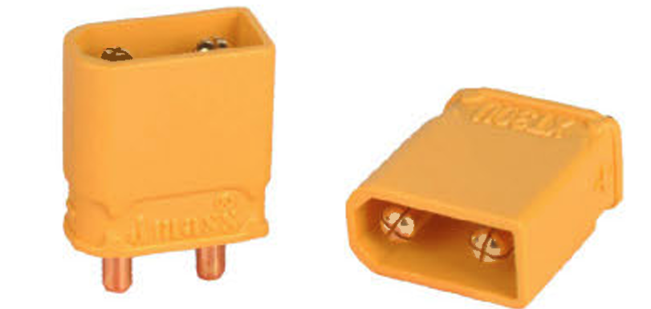
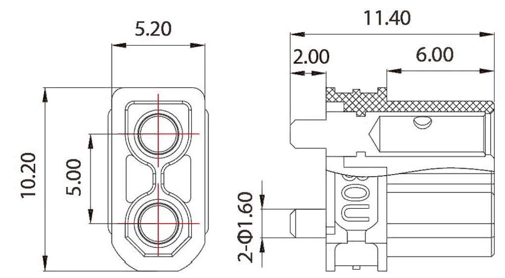
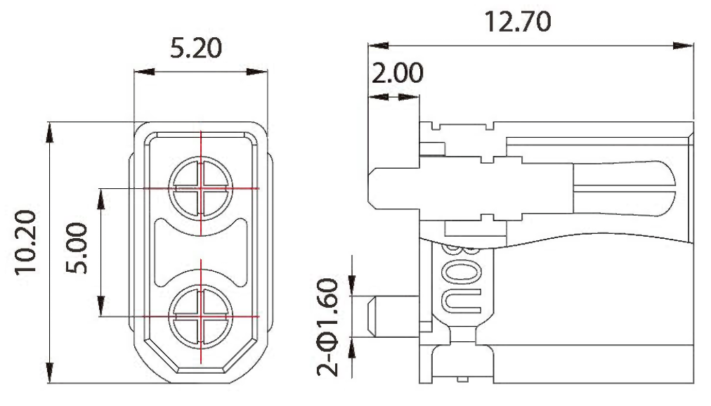

# 插头

## 一、Dean连接器

Dean连接器（也称T-Plug）是一种广泛应用于RC模型、电池组等领域的连接器，以其紧凑的尺寸和良好的性能而受到欢迎。

​

​		​

### 技术规格

|**参数**|**规格**|
| --| ------------------------------------------------|
|**额定电流**|持续15A，峰值30A（适配16-18 AWG电线）|
|**尺寸**|尺寸较小，适合紧凑型电路设计|
|**焊接要求**|需要热缩管进行绝缘保护|
|**材料**|通常采用镀铜接触件，提供良好的导电性和耐腐蚀性|
|**工作温度**|通常在-20°C至120°C范围内|
|**接触电阻**|通常小于10mΩ|

## 二、XT连接器

XT连接器是一种大电流连接器，最初由中国制造商Amass设计，旨在为要求苛刻的便携式电子产品提供易于使用、紧凑且耐用的连接器。其设计初衷是解决高端锂电类遥控模型在短时间内的大电流充放电需求。

​		​

​

### 技术规格

|**型号**|**额定电流（A）**|**瞬时电流（A）**|**推荐线规（AWG）**|**接触电阻（mΩ）**|**工作温度（°C）**|**绝缘材料**|**阻燃等级**|
| ------| ----| ----| ----| ------| ------------| --------| ----------|
|XT30|15|30|18|0.70|-20 至 120|聚酰胺|UL94 V-0|
|XT60|30|60|12|0.55|-20 至 120|聚酰胺|UL94 V-0|
|XT90|40|90|10|0.30|-20 至 120|聚酰胺|UL94 V-0|

## 对比

|**连接器**|**额定电流**|**尺寸**|**焊接要求**|**应用领域**|
| ------| ------------------| ------------------| --------------| ------------------------|
|Dean|持续15A，峰值30A|小型化设计|需热缩管保护|RC模型、电池组|
|XT30|持续15A，峰值30A|中等尺寸|需热缩管保护|微型无人机、低功率设备|
|XT60|持续30A，峰值60A|较大尺寸|需热缩管保护|中等功率设备|
|XT90|持续40A，峰值90A|较大尺寸，带后壳|无需热缩管|高功率设备|
